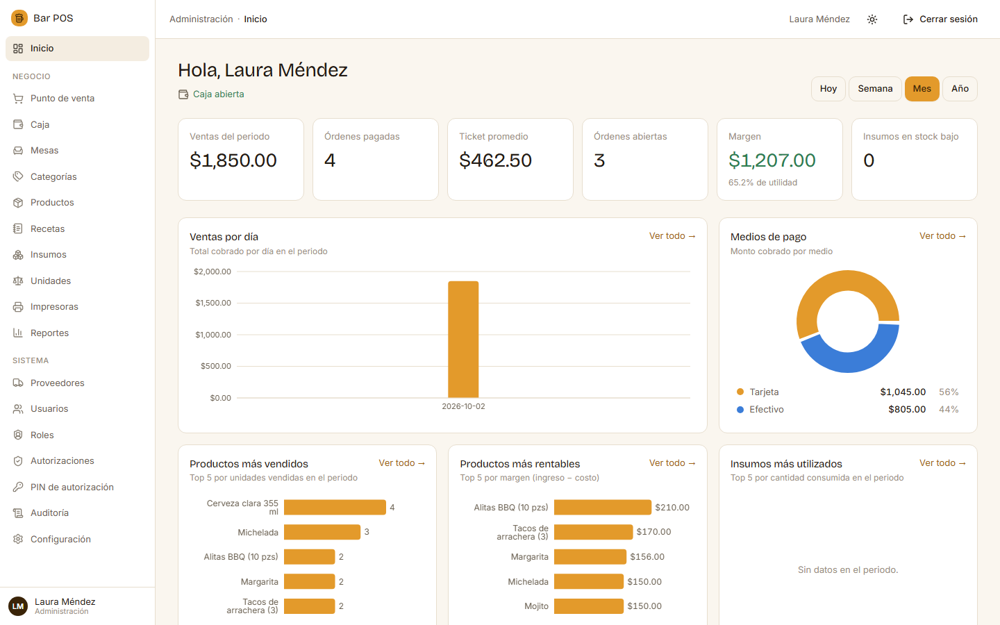

# tECHnologies POS — Backend API

Multi-tenant REST API for a point-of-sale system for bars and restaurants. It covers the full
operating cycle: authentication, establishments (tenants), catalog, recipe-based inventory,
cash register, orders, payments, kitchen/receipt printing, two-level authorizations, reports
and audit log.

The web client lives in a separate repository:
[**technologies-pos-frontend**](https://github.com/HH27NT/technologies-pos-frontend).



<sub>Web client running against this API with fictional demo data.</sub>

**Stack:** PHP 8.2 · Laravel 12 · PostgreSQL 16 · Sanctum (API tokens) ·
spatie/laravel-permission · DomPDF · Laravel Excel · PHPUnit 11 · Docker

## Features

- **Multi-tenancy:** data isolated per establishment through an Eloquent global scope; a
  `super_admin` can act on a given establishment through the `X-Establecimiento-Id` header,
  which is audited.
- **Roles and permissions:** `super_admin`, `admin`, `gerente` (manager), `operador` and
  `mesero` (waiter), with per-resource policies.
- **Catalog and inventory:** categories, products, recipes (bill of materials), suppliers,
  units of measure, supplies with stock movements and a kardex per supply.
- **Sales cycle:** tables, cash register open/close, orders and items, discounts,
  cancellations, voids, and partial or full payments with running balance.
- **Printing:** kitchen tickets (comandas) and receipts sent to printers through queued jobs.
- **Authorizations:** sensitive operations (cancel item, void order, stock adjustments) require
  manager approval, either immediately with a 6-digit authorizer PIN or asynchronously through
  an approval inbox. Shared-tablet mode identifies the waiter by PIN.
- **Reports:** dashboard, sales, sales per waiter, inventory, cash, payment methods,
  cancellations and margin; export to PDF/Excel as a queued job.
- **Audit log** per tenant and global.

## Getting started (Docker)

Requirements: Docker with Compose v2.

```bash
cp .env.docker.example .env.docker
# Edit .env.docker and set DB_PASSWORD, SUPER_ADMIN_PASSWORD and POS_PIN_LOOKUP_KEY.
# The PIN key is "base64:" + 32 random bytes, e.g.:  echo "base64:$(openssl rand -base64 32)"
# (or `php artisan pos:pin-key --show`). APP_KEY is generated automatically.
docker compose --env-file .env.docker up -d --build
```

If the very first start stops with `dependency db failed to start ... is unhealthy` (PostgreSQL
can take longer than the healthcheck window while it initializes its volume), run the same
`up -d` command again.

This starts three services: `db` (PostgreSQL), `app` (Laravel) and `queue` (queue worker).
On first start the `app` container waits for the database, runs the migrations and the
idempotent seeders (global catalogs, roles/permissions and the first super admin).

- API: `http://localhost:8080/api/v1`
- PostgreSQL from the host: port `5433`

```bash
# Every request must send Accept: application/json
curl -H "Accept: application/json" http://localhost:8080/api/v1/auth/me      # -> 401
curl -X POST -H "Accept: application/json" -H "Content-Type: application/json" \
     -d '{"login":"<SUPER_ADMIN_USERNAME>","password":"<SUPER_ADMIN_PASSWORD>"}' \
     http://localhost:8080/api/v1/auth/login                                  # -> token
```

Use the returned token as `Authorization: Bearer <token>`.

## Getting started (local, without Docker)

Requirements: PHP 8.2+ (`pdo_pgsql`, `mbstring`, `bcmath`, `intl`, `gd`, `zip`), Composer 2 and
PostgreSQL 16+.

```bash
composer install
cp .env.example .env
php artisan key:generate
# configure DB_* in .env (DB_CONNECTION=pgsql) and set POS_PIN_LOOKUP_KEY
php artisan migrate --seed
php artisan serve                                                   # http://127.0.0.1:8000
php artisan queue:work --queue=impresion,reportes,default           # second terminal
```

## Tests

```bash
php artisan test                                   # SQLite in memory (default)
php artisan test -c phpunit.pgsql.xml              # PostgreSQL parity (needs a test DB)
./vendor/bin/pint --test                           # code style
```

The GitHub Actions workflow (`.github/workflows/ci.yml`) checks reversible migrations, Pint and
runs the full suite on PostgreSQL 16.

The suite needs an application key: create `.env` and run `php artisan key:generate` first
(or set `APP_KEY` in the environment).

Latest local run (SQLite, inside the project's Docker image): **419 tests, 1,229 assertions,
all passing**.

## API overview

All routes are under `/api/v1`. Private routes go through
`auth:sanctum → resolve.tenant → tenant.activo`; sales writes also require `caja.abierta`
(an open cash register).

| Module | Main endpoints |
|---|---|
| Auth | `auth/login`, `auth/recuperar`, `auth/logout`, `auth/me` |
| Establishments / settings | `establecimientos`, `configuracion` |
| Users / roles / PINs | `usuarios`, `roles`, `mi-pin`, `usuarios/{id}/mesero-pin`, `terminal/*` |
| Catalog | `categorias`, `productos`, `recetas` |
| Inventory | `proveedores`, `unidades-medida`, `insumos`, `insumos/{id}/kardex`, `movimientos` |
| Tables / cash | `mesas`, `caja/abrir`, `caja/cerrar`, `caja/actual`, `caja/historico` |
| Orders / payments | `ordenes` (+ items, comanda, descuento, cancelar, anular), `ordenes/{id}/pagos`, `ordenes/{id}/saldo` |
| Printing | `impresoras`, `ordenes/{id}/ticket`, `tickets/{id}/reimprimir` |
| Authorizations | `autorizaciones` (+ aprobar, rechazar) |
| Audit / reports | `auditoria`, `reportes/*`, `reportes/exportar` |

See `routes/api.php` for the full list.

## Project structure

```
app/
  Domain/        business logic per module (Ordenes, Pagos, Inventario, Caja, Impresion,
                 Autorizaciones, Reportes, Usuarios, Establecimientos, Catalogo, Auditoria)
  Http/          API v1 controllers, form requests, resources, middleware
  Jobs/          queued jobs (kitchen tickets, receipts, report export)
  Listeners/     domain event listeners
  Models/        Eloquent models
  Policies/      per-resource authorization
database/        migrations and seeders
docker/          PHP and Nginx configuration for the containers
docs/            architecture, functional spec, ER diagram, data dictionary, sprint reviews
routes/api.php   API v1 routes
tests/           Unit, Feature and Integration tests
```

## Authors

- **Eduardo Palacios Quiroz** — [@LaloP1](https://github.com/LaloP1) — lead developer
- **Hector Hugo Naranjo** — security hardening (authorization-PIN key separated from `APP_KEY`, secrets removed from the repo), Docker startup fixes and full-stack features

## License

[MIT](LICENSE) © 2026 Eduardo Palacios Quiroz and Hector Hugo Naranjo

---

## Resumen en español

API REST multi-tenant en Laravel 12 + PostgreSQL para un punto de venta de bares y
restaurantes: establecimientos, catálogo, inventario con recetas, caja, órdenes, cobros,
impresión de comandas y tickets, autorizaciones con PIN, reportes exportables a PDF/Excel y
auditoría. Se levanta con `docker compose --env-file .env.docker up -d --build` (después de
copiar y completar `.env.docker.example`) y queda en `http://localhost:8080/api/v1`. Pruebas
con `php artisan test`. Proyecto liderado por Eduardo Palacios Quiroz (@LaloP1), con contribuciones de Hector Hugo Naranjo,
con licencia MIT.
